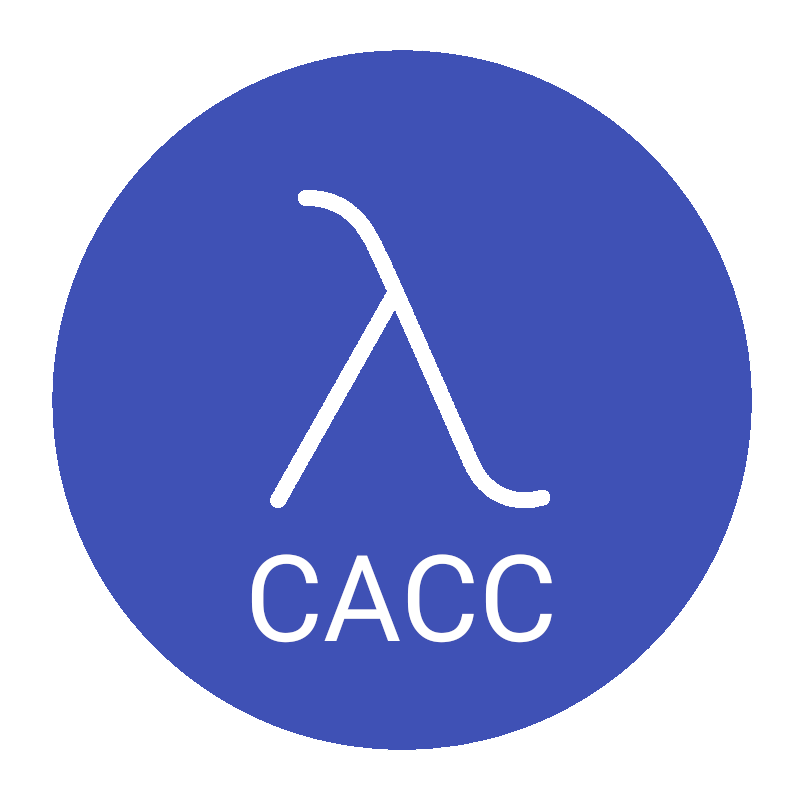

# 📚 Historico #

Bem vindo 😎

É do curso de Ciência da Computação da UFFS ? Calouro talvez ?

Existem grupos onde você pode se informar:

- [Facebook](https://www.facebook.com/groups/CACCUFFSCCO/): <https://www.facebook.com/groups/CACCUFFSCCO/>
- [Telegram](https://t.me/ccuffs): <https://t.me/ccuffs>
- [Whatsapp](https://chat.whatsapp.com/CPQrLeFht2XBiFfT9IBoci): <https://chat.whatsapp.com/CPQrLeFht2XBiFfT9IBoci>

## 📑 Sumário ##

- [📚 Historico](#-historico)
  - [📑 Sumário](#-sumário)
  - [👥 Gestões passadas](#-gestões-passadas)
  - [📜 Estatuto](#-estatuto)
  - [📐 Modelos de Moletons](#-modelos-de-moletons)

## 👥 Gestões passadas ##

- [👥 Histórico de chapas](HISTORICO-CHAPAS.md)

## 📜 Estatuto ##

- [📜 Estatuto](arquivos/estatuto.pdf)

## 📐 Modelos de Moletons ##

- [📐 Modelos de Moletons](arquivos/Moletom/)
